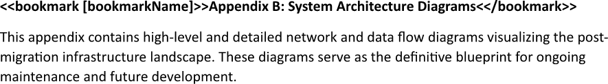
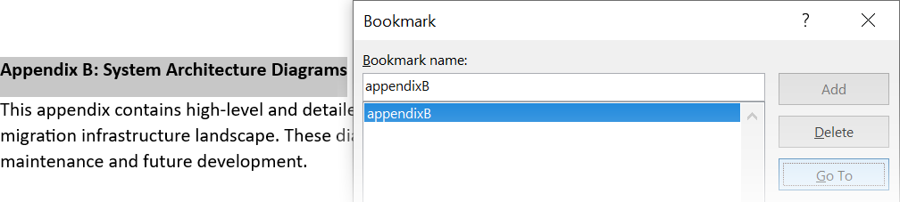

Inserting a bookmark is useful for creating an internal navigation system, which functions like a custom, interactive table of
contents or index. This allows readers to efficiently jump directly to specific sections, charts, or data points without
manually scrolling through many pages. You can insert a bookmark using LINQ Reporting Engine in C#.

## How to Insert a Bookmark

1. Prepare data for your bookmark in one of [formats supported by LINQ Reporting Engine](),
for example, a JSON file as follows:




2. In Microsoft Word, create a template document, go to a position within its text at which to start a bookmark, and bind
the name of the bookmark to a value by adding a `bookmark` tag, for instance, like so:

<<bookmark [bookmarkName]>>


3. Add a closing `bookmark` tag at a position within the template's text where to end the bookmark this way:

<</bookmark>>


{}

Opening and closing `bookmark` tags cannot be located within a chart.

{}

4. Review your bookmark template before saving, it should look like this:\
\

5. Build your bookmark using LINQ Reporting Engine by running the following C# code:\


## Bookmark Inserting Report Example

After taking all the steps, LINQ Reporting Engine creates a bookmark report as follows:\
\

{}

You can download the [template
](https://github.com/aspose-words/Aspose.Words-for-.NET/raw/ivan.lyagin/UEX-331/Examples/Data/LINQ/Bookmark%20Inserting%20Template.docx)
and [data
](https://github.com/aspose-words/Aspose.Words-for-.NET/raw/ivan.lyagin/UEX-331/Examples/Data/LINQ/Bookmark%20Inserting%20Data.json)
from the example, and try to insert a bookmark online for free by using one of the options:\
<a class="product-item docs-btn" href="https://products.aspose.app/words/assembly" >APP </a>
<a class="product-item docs-btn" href="https://products.aspose.com/words/net/report/" >.NET API </a>
<a class="product-item docs-btn" href="https://products.aspose.com/words/python-net/report/" >
PYTHON via <em class="docs-vianet">net</em> API</a>
 
 

{}

## See Also

- [Working with Links]()
- [LINQ Reporting Engine]()
- [ReportingEngine Class](https://reference.aspose.com/words/net/aspose.words.reporting/reportingengine/)

{}