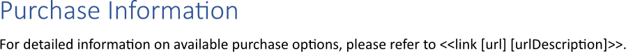

Inserting a [hyperlink](https://en.wikipedia.org/wiki/Hyperlink) allows the reader to instantly access additional context and
source materials, such as related articles or external websites, directly from text. This practice significantly enhances
credibility and transparency of a report by providing verifiable evidence for claims, while also keeping the main document
concise and focused. You can insert a hyperlink using LINQ Reporting Engine in C#.

## How to Insert a Hyperlink

1. Prepare data for your hyperlink in one of [formats supported by LINQ Reporting Engine](),
for example, a JSON file as follows:




2. In Microsoft Word, create a template document, go to a position within its text at which to put a hyperlink, and bind
the hyperlink to the data by adding a `link` tag and declaring values to define the URI to navigate and display text for
the hyperlink respectively, for instance, like so:

<<link [url] [urlDescription]>>


{}

A value defining the display text can be omitted, then the URI is used as the hyperlink's display text as well. Also, note
that `link` tags cannot be located within a chart.

{}

3. Review your hyperlink template before saving, it should look like this:\
\

4. Build your hyperlink using LINQ Reporting Engine by running the following C# code:\


## Hyperlink Inserting Report Example

After taking all the steps, LINQ Reporting Engine creates a hyperlink report as follows:\
\

{}

You can download the [template
](https://github.com/aspose-words/Aspose.Words-for-.NET/raw/ivan.lyagin/UEX-331/Examples/Data/LINQ/Hyperlink%20Inserting%20Template.docx)
and [data
](https://github.com/aspose-words/Aspose.Words-for-.NET/raw/ivan.lyagin/UEX-331/Examples/Data/LINQ/Hyperlink%20Inserting%20Data.json)
from the example, and try to insert a hyperlink online for free by using one of the options:\
<a class="product-item docs-btn" href="https://products.aspose.app/words/assembly" >APP </a>
<a class="product-item docs-btn" href="https://products.aspose.com/words/net/report/" >.NET API </a>
<a class="product-item docs-btn" href="https://products.aspose.com/words/python-net/report/" >
PYTHON via <em class="docs-vianet">net</em> API</a>
 
 

{}

## See Also

- [Working with Links]()
- [LINQ Reporting Engine]()
- [ReportingEngine Class](https://reference.aspose.com/words/net/aspose.words.reporting/reportingengine/)

{}