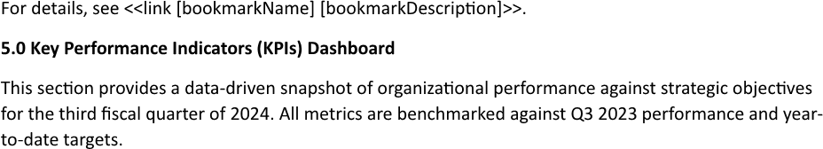
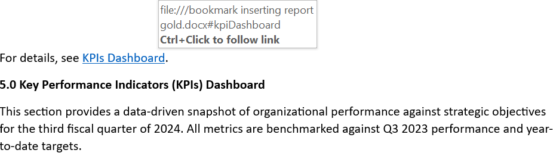

Inserting a link to a bookmark creates a clickable navigation path, allowing users to instantly jump to a specific, predefined
section within a long document. This mechanism improves user experience by transforming static content into an interactive
document, saving time and making it easier to find key information without endless scrolling. You can insert a link to
a bookmark using LINQ Reporting Engine in C#.

## How to Insert a Link to a Bookmark

1. Prepare data for your link in one of [formats supported by LINQ Reporting Engine](),
for example, a JSON file as follows:




2. In Microsoft Word, create a template document, go to a position within its text at which to put a link to a bookmark, and
bind the link to the data by adding a `link` tag and declaring values to define the bookmark's name and display text for
the link respectively, for instance, like so:

<<link [bookmarkName] [bookmarkDescription]>>


{}

* A value provided for the bookmark's name should correspond to a bookmark accessible at the position of the `link` tag, which
means that the bookmark should be added either [manually to
the template](https://support.microsoft.com/en-us/office/add-or-delete-bookmarks-in-a-word-document-or-outlook-message-f68d781f-0150-4583-a90e-a4009d99c2a0)
or [using LINQ Reporting Engine]() before linking the bookmark.

* A value defining the display text can be omitted, then the bookmark's name is used as the link's display text as well.

* `link` tags cannot be located within a chart.

{}

3. Review your link template before saving, it should look like this:\
\

4. Build your link using LINQ Reporting Engine by running the following C# code:\


## Link to Bookmark Inserting Report Example

After taking all the steps, LINQ Reporting Engine creates a link report as follows:\
\

{}

You can download the [template
](https://github.com/aspose-words/Aspose.Words-for-.NET/raw/ivan.lyagin/UEX-331/Examples/Data/LINQ/Link%20to%20Bookmark%20Inserting%20Template.docx)
and [data
](https://github.com/aspose-words/Aspose.Words-for-.NET/raw/ivan.lyagin/UEX-331/Examples/Data/LINQ/Link%20to%20Bookmark%20Inserting%20Data.json)
from the example, and try to insert a link to a bookmark online for free by using one of the options:\
<a class="product-item docs-btn" href="https://products.aspose.app/words/assembly" >APP </a>
<a class="product-item docs-btn" href="https://products.aspose.com/words/net/report/" >.NET API </a>
<a class="product-item docs-btn" href="https://products.aspose.com/words/python-net/report/" >
PYTHON via <em class="docs-vianet">net</em> API</a>
 
 

{}

## See Also

- [Working with Links]()
- [LINQ Reporting Engine]()
- [ReportingEngine Class](https://reference.aspose.com/words/net/aspose.words.reporting/reportingengine/)

{}