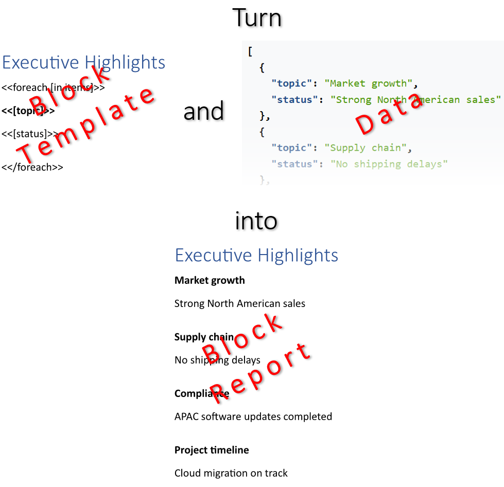

Template blocks allow for the automatic generation of clean, structured reports by dynamically repeating sections for each
unique data item without manual layout adjustments. Furthermore, configuring these blocks to appear only when specific
expressions meet defined criteria ensures that final documents contain exclusively relevant, tailored information. You can make
a report by building it up of template blocks based on data and filling the blocks with data using LINQ Reporting Engine in
C#.\
\

The process of building a report upon template blocks and data incorporates the following steps:

1. Preparing data for the report in one of [supported formats]()

2. Creating a template document in Microsoft Word

3. Running C# code invoking [LINQ Reporting Engine
APIs](https://reference.aspose.com/words/net/aspose.words.reporting/reportingengine/)

{}

A typical block template represents a regular Microsoft Word document with special tags added to it: `foreach` and `if` tags
for manipulating template blocks and expression tags for binding the blocks with data.

{}

To learn more on building a report up of template blocks based on data using LINQ Reporting Engine in C#, please refer to
the following sections:



{}