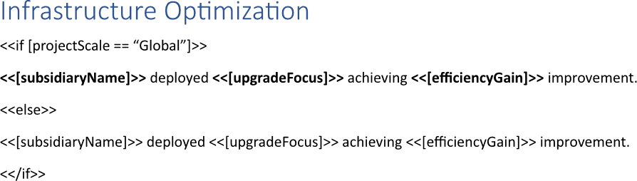
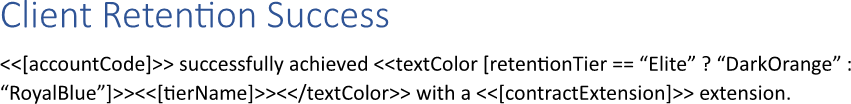
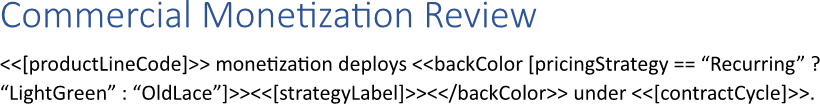

Applying conditional formatting to template blocks enables the report to highlight data dynamically based on underlying values,
making key insights immediately visible to the reader. The feature also permits the automatic adjustment of visual elements such
as colors or fonts when specific criteria are met, thereby enhancing the overall readability and impact of the report. You can
apply conditional formatting to a template block using LINQ Reporting Engine in C#.

## How to Apply Conditional Formatting to a Template Block

1. Prepare data for your report in one of [formats supported by LINQ Reporting Engine](),
for example, a JSON file as follows:




2. In Microsoft Word, bind visibility of a template block to a Boolean value by adding an opening `if` tag to the beginning of
the block, for instance, like this:

<<if [projectScale == "Global"]>>


3. Bind the template block to data values by adding expression tags after the opening `if` tag such as the following ones:

<<[subsidiaryName]>>


<<[upgradeFocus]>>


<<[efficiencyGain]>>


3. Bind visibility of an alternative template block to the opposite value by appending an `else` tag this way:

<<else>>


4. Bind the altenative template block to the same data values by adding the same expression tags after the `else` tag.

5. Add a closing `if` tag to the end of the alternative template block like so:

<</if>>


6. Apply different formatting to every of the two template blocks depending on your needs.

7. Review your block template before saving, it should look like this:\
\

8. Build your block report using LINQ Reporting Engine by running the following C# code:\


## Template Block with Conditional Formatting Applied Report Example

After taking all the steps, LINQ Reporting Engine creates a report with the template block formatted as follows:\
\

Now, let us consider the alternative case where data for the report implies another formatting of the template block, for
example, like so:




After running the same code with the JSON file being used instead, LINQ Reporting Engine generates a block report with
the template block formatted like this:\
\

Thus, you can control formatting of a template block based on a condition.

{}

You can download the [template
](https://github.com/aspose-words/Aspose.Words-for-.NET/raw/ivan.lyagin/UEX-331/Examples/Data/LINQ/Template%20Block%20with%20Conditional%20Formatting%20Applied%20Template.docx)
and [data
](https://github.com/aspose-words/Aspose.Words-for-.NET/raw/ivan.lyagin/UEX-331/Examples/Data/LINQ/Template%20Block%20with%20Conditional%20Formatting%20Applied%20Data%201.json)
from the example, and try to apply conditional formatting to a template block online for free by using one of
the options:\
<a class="product-item docs-btn" href="https://products.aspose.app/words/assembly" >APP </a>
<a class="product-item docs-btn" href="https://products.aspose.com/words/net/report/" >.NET API </a>
<a class="product-item docs-btn" href="https://products.aspose.com/words/python-net/report/" >
PYTHON via <em class="docs-vianet">net</em> API</a>
 
 

{}

## How to Apply a Text Color to a Template Block

{}

This guide provides a shortcut method for applying only text colors to template blocks.

{}

1. Prepare data for your report in one of [formats supported by LINQ Reporting Engine](),
for example, a JSON file as follows:




2. In Microsoft Word, bind a template document to data values that do not require text coloring by adding expression tags to the
template such as the following ones:

<<[accountCode]>>


<<[contractExtension]>>


3. Bind the text color of a template block to a [color value]() by adding an opening
`textColor` tag to the beginning of the block like that:

<<textColor [retentionTier == "Elite" ? "DarkOrange" : "RoyalBlue"]>>


{}

A color value can be directly stored in a data source, for example, as an object property.

{}

4. Bind the template block to data values by adding expression tags to the block after the opening `textColor` tag, such as:

<<[tierName]>>


5. Add a closing `textColor` tag at the end of the template block this way:

<</textColor>>


6. Review your block template before saving, it should look like this:\
\

7. Build your block report using LINQ Reporting Engine by running the following C# code:\


## Template Block with a Text Color Applied Report Example

After taking all the steps, LINQ Reporting Engine creates a block report as follows:\
\

{}

You can download the [template
](https://github.com/aspose-words/Aspose.Words-for-.NET/raw/ivan.lyagin/UEX-331/Examples/Data/LINQ/Template%20Block%20with%20Text%20Color%20Applied%20Template.docx)
and [data
](https://github.com/aspose-words/Aspose.Words-for-.NET/raw/ivan.lyagin/UEX-331/Examples/Data/LINQ/Template%20Block%20with%20Text%20Color%20Applied%20Data.json)
from the example, and try to apply a text color to a template block online for free by using one of
the options:\
<a class="product-item docs-btn" href="https://products.aspose.app/words/assembly" >APP </a>
<a class="product-item docs-btn" href="https://products.aspose.com/words/net/report/" >.NET API </a>
<a class="product-item docs-btn" href="https://products.aspose.com/words/python-net/report/" >
PYTHON via <em class="docs-vianet">net</em> API</a>
 
 

{}

## How to Apply a Background Color to a Template Block

{}

This guide provides a shortcut method for applying only background colors to template blocks.

{}

1. Prepare data for your report in one of [formats supported by LINQ Reporting Engine](),
for example, a JSON file as follows:




2. In Microsoft Word, bind a template document to data values that do not require background coloring by adding expression tags 
to the template such as the following ones:

<<[productLineCode]>>


<<[contractCycle]>>


3. Bind the background color of a template block to a [color value]() by adding an opening 
`backColor` tag to the beginning of the block like that:

<<backColor [pricingStrategy == "Recurring" ?  "LightGreen" : "OldLace"]>>


{}

A color value can be directly stored in a data source, for example, as an object property.

{}

4. Bind the template block to data values by adding expression tags to the block after the opening `backColor` tag, such as:

<<[strategyLabel]>>


5. Add a closing `backColor` tag at the end of the template block this way:

<</backColor>>


6. Review your block template before saving, it should look like this:\
\

7. Build your block report using LINQ Reporting Engine by running the following C# code:\


## Template Block with a Background Color Applied Report Example

After taking all the steps, LINQ Reporting Engine creates a block report as follows:\
\

{}

You can download the [template
](https://github.com/aspose-words/Aspose.Words-for-.NET/raw/ivan.lyagin/UEX-331/Examples/Data/LINQ/Template%20Block%20with%20Background%20Color%20Applied%20Template.docx)
and [data
](https://github.com/aspose-words/Aspose.Words-for-.NET/raw/ivan.lyagin/UEX-331/Examples/Data/LINQ/Template%20Block%20with%20Background%20Color%20Applied%20Data.json)
from the example, and try to apply a background color to a template block online for free by using one of
the options:\
<a class="product-item docs-btn" href="https://products.aspose.app/words/assembly" >APP </a>
<a class="product-item docs-btn" href="https://products.aspose.com/words/net/report/" >.NET API </a>
<a class="product-item docs-btn" href="https://products.aspose.com/words/python-net/report/" >
PYTHON via <em class="docs-vianet">net</em> API</a>
 
 

{}

{}

## See Also

- [Working with Template Blocks]()
- [LINQ Reporting Engine]()
- [ReportingEngine Class](https://reference.aspose.com/words/net/aspose.words.reporting/reportingengine/)

{}