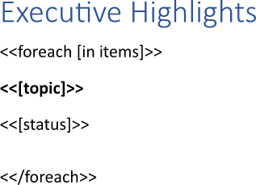
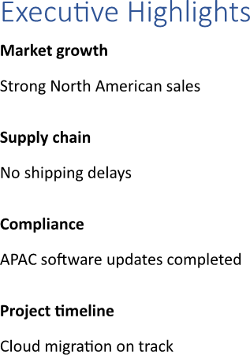
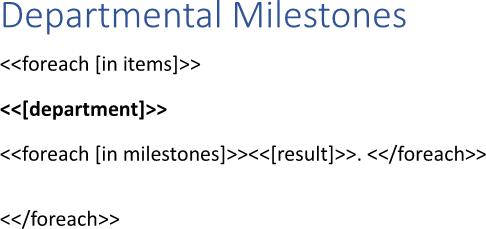
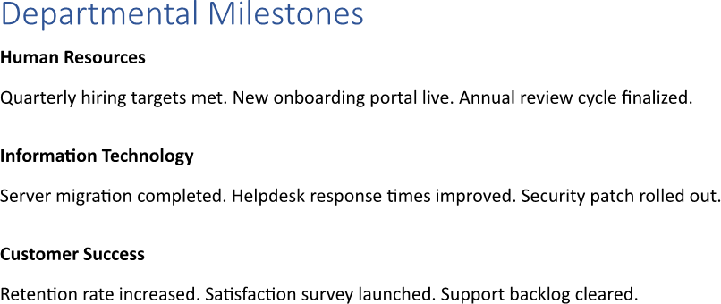

Repeating a template block allows a defined section of a report to be reproduced automatically for each item of a data
collection, preserving layout and calculations uniformly. This capability eliminates the need to recreate the same design
repeatedly and ensures that any modification to the block is reflected instantly throughout the entire report. You can repeat a
template block using LINQ Reporting Engine in C#.

## How to Repeat a Template Block

1. Prepare data for your report in one of [formats supported by LINQ Reporting Engine](),
for example, a JSON file as follows:




2. In Microsoft Word, bind a template block to a data collection by adding an opening `foreach` tag to the beginning of the
block as per the example:  

<<foreach [in items]>>


3. Add a closing `foreach` tag to the end of the template block like that:

<</foreach>>


4. Bind the template block to values calculated upon an item of the data collection by adding expression tags to the block
between the opening and closing `foreach` tags such as the following ones:

<<[topic]>>


<<[status]>>


5. Review your template block repeating template before saving, it should look like this:\
\

6. Build your report repeating a template block using LINQ Reporting Engine by running the following C# code:\


## Template Block Repeating Report Example

After taking all the steps, LINQ Reporting Engine creates a template block repeating report as follows:\
\

{}

You can download the [template
](https://github.com/aspose-words/Aspose.Words-for-.NET/raw/ivan.lyagin/UEX-331/Examples/Data/LINQ/Template%20Block%20Repeating%20Template.docx)
and [data
](https://github.com/aspose-words/Aspose.Words-for-.NET/raw/ivan.lyagin/UEX-331/Examples/Data/LINQ/Template%20Block%20Repeating%20Data.json)
from the example, and try to repeat a template block online for free by using one of
the options:\
<a class="product-item docs-btn" href="https://products.aspose.app/words/assembly" >APP </a>
<a class="product-item docs-btn" href="https://products.aspose.com/words/net/report/" >.NET API </a>
<a class="product-item docs-btn" href="https://products.aspose.com/words/python-net/report/" >
PYTHON via <em class="docs-vianet">net</em> API</a>
 
 

{}

## How to Repeat Master-Detail Template Blocks

1. Prepare data for your report in one of [formats supported by LINQ Reporting Engine](),
for example, a JSON file as follows:




2. In Microsoft Word, bind a master template block to a master data collection by adding an opening `foreach` tag to the
beginning of the block as per the example:

<<foreach [in items]>>


3. Add a closing `foreach` tag to the end of the block like so:

<</foreach>>


4. Bind the master block to values calculated upon an item of the master collection by adding expression tags between the
opening and closing `foreach` tags such as:

<<[department]>>


5. Bind a detail template block to a detail data collection calculated upon an item of the master data collection by adding an
inner opening `foreach` tag to the beginning of the detail block between the outer opening and closing `foreach` tags as per the
example:

<<foreach [in milestones]>>


6. Add an inner closing `foreach` tag to the end of the detail block between the outer opening and closing `foreach` tags like
that:

<</foreach>>


7. Bind the detail block to values calculated upon an item of the detail collection by adding expression tags between the inner
opening and closing `foreach` tags such as:

<<[result]>>


8. Review your master-detail template blocks repeating template before saving, it should look like this:\
\

9. Build your report repeating master-detail template blocks using LINQ Reporting Engine by running the following C# code:\


## Master-Detail Template Blocks Repeating Report Example

After taking all the steps, LINQ Reporting Engine creates a master-detail template blocks repeating report as follows:\
\

{}

You can download the [template
](https://github.com/aspose-words/Aspose.Words-for-.NET/raw/ivan.lyagin/UEX-331/Examples/Data/LINQ/Master-Detail%20Template%20Blocks%20Repeating%20Template.docx)
and [data
](https://github.com/aspose-words/Aspose.Words-for-.NET/raw/ivan.lyagin/UEX-331/Examples/Data/LINQ/Master-Detail%20Template%20Blocks%20Repeating%20Data.json)
from the example, and try to repeat master-detail template blocks online for free by using one of
the options:\
<a class="product-item docs-btn" href="https://products.aspose.app/words/assembly" >APP </a>
<a class="product-item docs-btn" href="https://products.aspose.com/words/net/report/" >.NET API </a>
<a class="product-item docs-btn" href="https://products.aspose.com/words/python-net/report/" >
PYTHON via <em class="docs-vianet">net</em> API</a>
 
 

{}

## See Also

- [Working with Template Blocks]()
- [Binding Collections]()
- [LINQ Reporting Engine]()
- [ReportingEngine Class](https://reference.aspose.com/words/net/aspose.words.reporting/reportingengine/)

{}