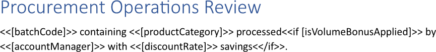
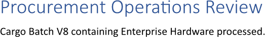

Showing a template block based on a condition allows the report to present only the relevant sections, keeping the output
concise and tailored to the data. By linking the condition to an expression, the layout can automatically adjust without
additional editing, enhancing maintainability and reducing the risk of errors. You can show a template block based on a
condition using LINQ Reporting Engine in C#.

## How to Show a Template Block Based on a Condition

1. Prepare data for your report in one of [formats supported by LINQ Reporting Engine](),
for example, a JSON file as follows:




2. In Microsoft Word, bind a template document to data values by adding expression tags to the template such as the following
ones:

<<[batchCode]>>


<<[productCategory]>>


<<[accountManager]>>


<<[discountRate]>>


3. Bind visibility of a template block to a Boolean value by adding an opening `if` tag to the beginning of the block as per the
example:

<<if [isVolumeBonusApplied]>>


4. Add a closing `if` tag to the end of the template block like so:

<</if>>


5. Review your block template before saving, it should look like this:\
\

6. Build your block report using LINQ Reporting Engine by running the following C# code:\


## Template Block Shown Based on a Condition Report Example

After taking all the steps, LINQ Reporting Engine creates a report with the template block shown as follows:\
\

Now, let us consider the alternative case where data for the report implies exclusion of the template block, for example, like
so:




After running the same code with the JSON file being used instead, LINQ Reporting Engine generates a block report with
the template block excluded like this:\
\

Thus, you can control showing or hiding of a template block based on a condition.

{}

You can download the [template
](https://github.com/aspose-words/Aspose.Words-for-.NET/raw/ivan.lyagin/UEX-331/Examples/Data/LINQ/Template%20Block%20Shown%20Based%20on%20Condition%20Template.docx)
and [data
](https://github.com/aspose-words/Aspose.Words-for-.NET/raw/ivan.lyagin/UEX-331/Examples/Data/LINQ/Template%20Block%20Shown%20Based%20on%20Condition%20Data%201.json)
from the example, and try to show a template block based on a condition online for free by using one of
the options:\
<a class="product-item docs-btn" href="https://products.aspose.app/words/assembly" >APP </a>
<a class="product-item docs-btn" href="https://products.aspose.com/words/net/report/" >.NET API </a>
<a class="product-item docs-btn" href="https://products.aspose.com/words/python-net/report/" >
PYTHON via <em class="docs-vianet">net</em> API</a>
 
 

{}

## See Also

- [Working with Template Blocks]()
- [LINQ Reporting Engine]()
- [ReportingEngine Class](https://reference.aspose.com/words/net/aspose.words.reporting/reportingengine/)

{}