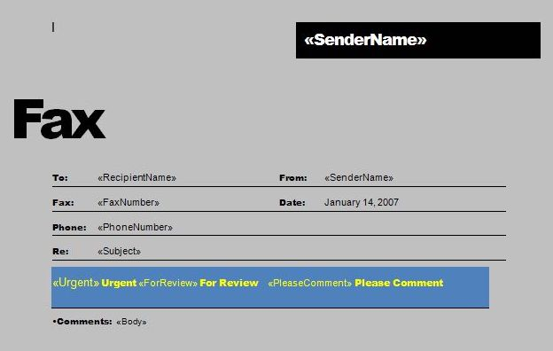

{}

*Purpose Summary. What is this page about?*

This page describes how to insert checkboxes, text inputs, or images during a Mail Merge operation in Aspose.Words for Python via .NET by handling the field merging events.

{}

The merge engine takes a document as input, looks for `MERGEFIELD` fields in it, and replaces them with the data obtained from the data source. Typically, plain text and HTML are inserted, but Aspose.Words users can also generate a document that handles more unusual scenarios for Mail Merge fields.

Powerful Aspose.Words functionality allows you to extend the Mail Merge process:

- insert checkboxes and text input form fields into the document during a mail merge
- insert images from any custom storage (files, streams, etc.)

## Insert Checkboxes and Text Input during Mail Merge

Sometimes it is necessary to perform a Mail Merge operation so that not text is substituted in the merge field, but a checkbox or text input field. Even though this is not the most common scenario, it is very handy for some tasks.

The following screenshot of a Word document shows a template with merge fields:

This screenshot of the Word document below shows the already generated document:

{}

Note that some fields were replaced with plain text, some fields were replaced with checkbox form fields, and the `Subject` field was replaced with a text input field.

{}

The following code example shows how to insert checkboxes and input text fields into a document during a mail merge:





## Insert Images during Mail Merge

When performing a Mail Merge operation, you can insert images into the document using special image Mail Merge fields. The image Mail Merge field is a merge field named `Image:MyFieldName`.

During a mail merge, when an image Mail Merge field is encountered in a document, the [field_merging_callback](https://reference.aspose.com/words/python-net/aspose.words.mailmerging/mailmerge/field_merging_callback/) event is fired and the `image_field_merging` method of your handler is invoked. You can respond to this event to return a file name, a stream, or a shape to the Mail Merge engine so it can be inserted into the document.

### Set Image Properties during Mail Merge

While merging an image merge field, you may sometimes need to control various image properties, such as [WrapType](https://reference.aspose.com/words/python-net/aspose.words.drawing/wraptype/).

Using [ImageFieldMergingArgs](https://reference.aspose.com/words/python-net/aspose.words.mailmerging/imagefieldmergingargs/) you can set the `image_file_name`, `image_stream`, `image_width`, and `image_height` properties. To get full control over the inserted image or any other shape, Aspose.Words provides the [shape](https://reference.aspose.com/words/python-net/aspose.words.mailmerging/imagefieldmergingargs/shape/) property.

The following code example shows how to set various image properties:






